# INSURANCE MANAGEMENT APPLICATION

## Introduction

I wrote this project in a team of three participants of a Python programming course, who devoted a total of 42 hours to its implementation, in accordance with the time allocated for the course. The aim of the project is to create an application enabling the management of users' insurance policies, both motor and insurance.

## Requirements
```bash
#create a virtual environment for application libriaries in Windows OS:
#add Python interpreter
#activating hermetic environment

venv\Scripts\activate
pip  install  -r  requirements.txt
pip  list
```
Check: [tutorial venv](https://docs.python.org/3/tutorial/venv.html)
/ [djangoproject](https://www.djangoproject.com/) documentation

## Installation

Steps required to install and run the project locally.

1. Clone the repository:

    ```bash
    https://github.com/grzegorzkoniuszewski/Insurance-management-application
    ```

2. Create and activate a virtual environment:

    ```bash
    python3 -m venv venv
    source venv/bin/activate
    ```

3. Install required dependencies:

    ```bash
    pip install -r requirements.txt
    ```

4. Perform database migrations:

    ```bash
    python manage.py migrate
    ```

5. Run the development server:

    ```bash
    python manage.py runserver
    ```

## Usage

The application is designed to facilitate the management of user insurance policies. Its features include:

1.  Adding, editing, and deleting user profiles.
2.  Adding, editing, and deleting insurance policies.
3.  Adding, editing, and deleting insurance companies.
4.  User panel functionality, including registration, login, and logout capabilities.


## Our application looks like this from the user's perspective:
1.Home page for those who do not have an account/users who are not logged in.
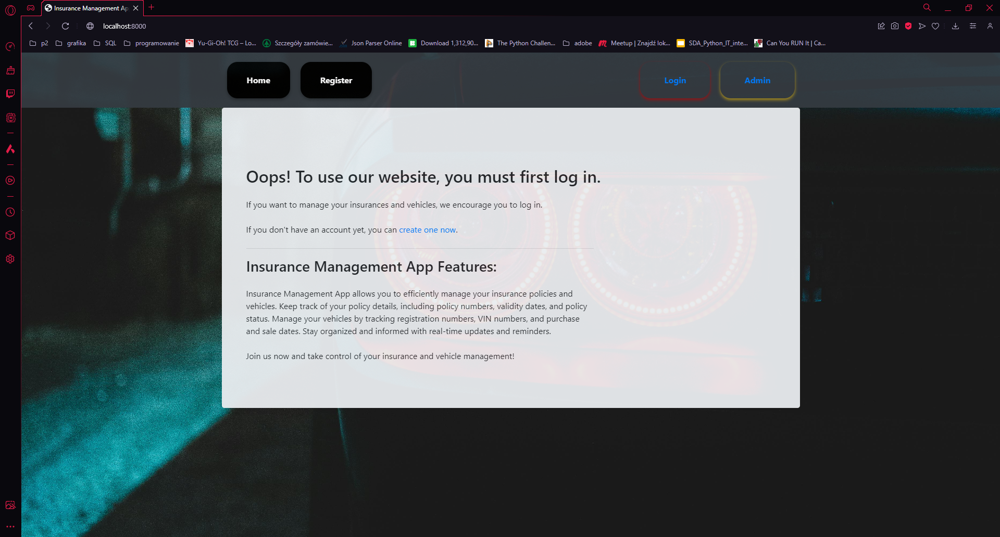


2.User registration page
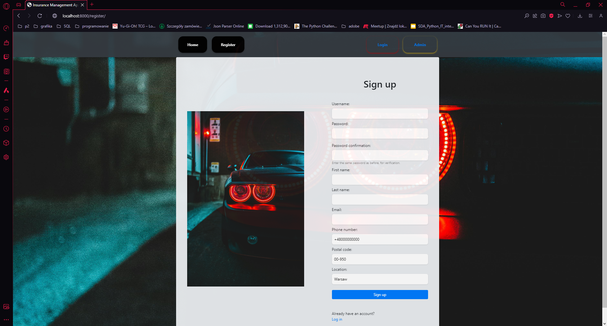


3.Login page
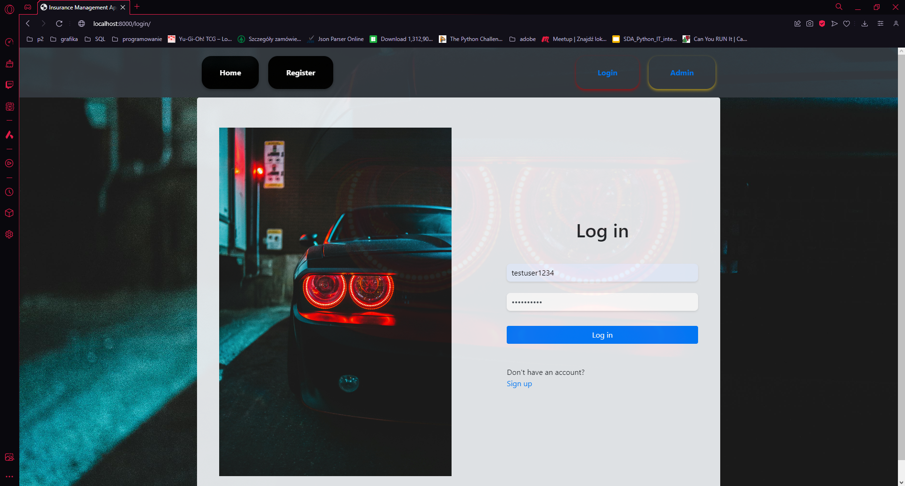


4.Home page for logged in users where you can fully manage and store data related to your current car insurance policies, those you will have in the future, or those purchased but not active due to the start date of insurance coverage.
The user also has the full ability to add cars and modify data related to them or set the car's status to "sold".
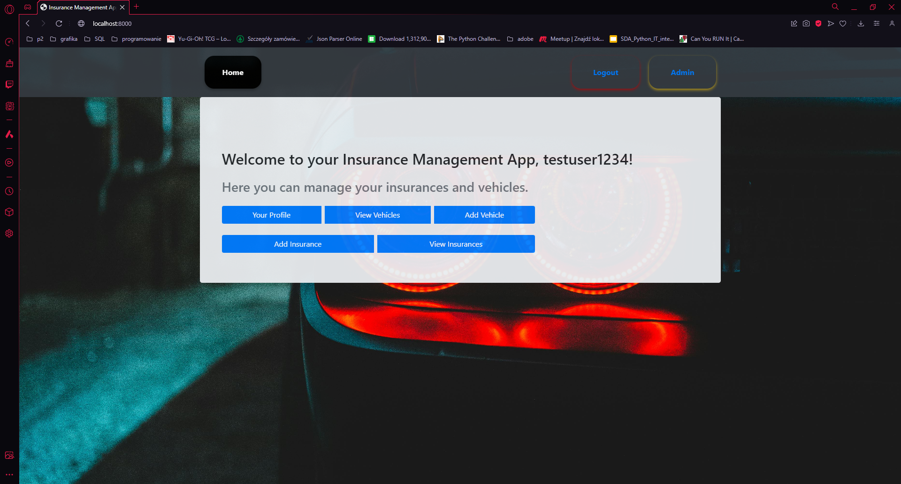

5.User detail page
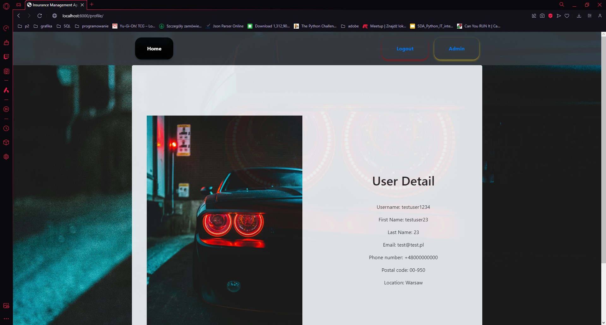

6.The user's insurance policies page before adding a new policy
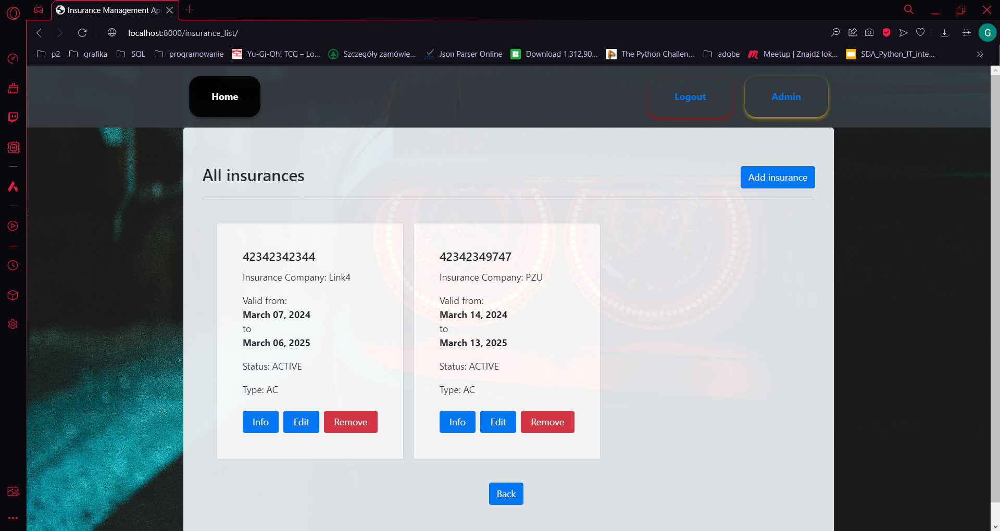

7.Insurance adding form
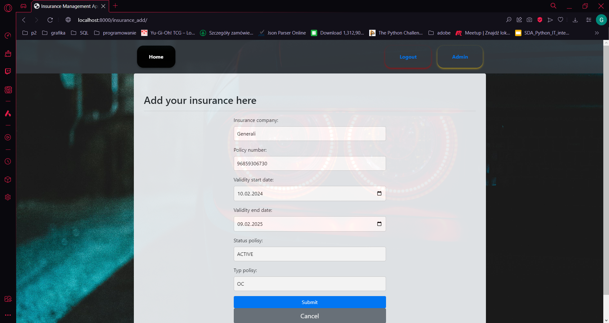

8.The user's insurance policy page after adding a new policy
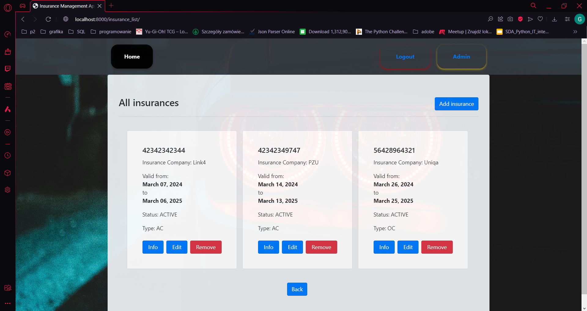

9.A page presenting details of a specific policy entered by the user after pressing the info button.
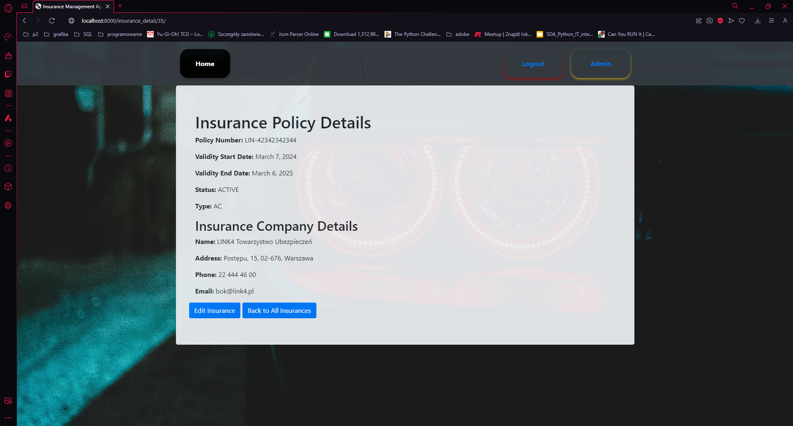

6.Vehicle list page


7.Vehicle adding form
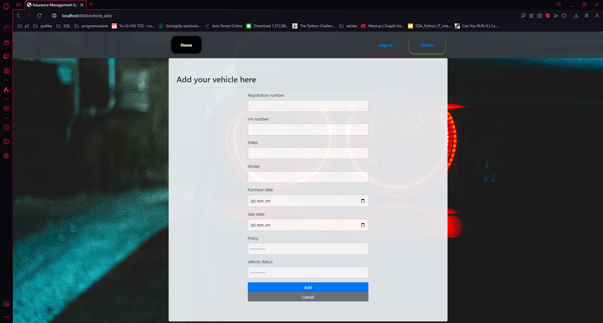

8.Page of deleting a policy/car after selecting the "Delete" option while on the list of policies/vehicles
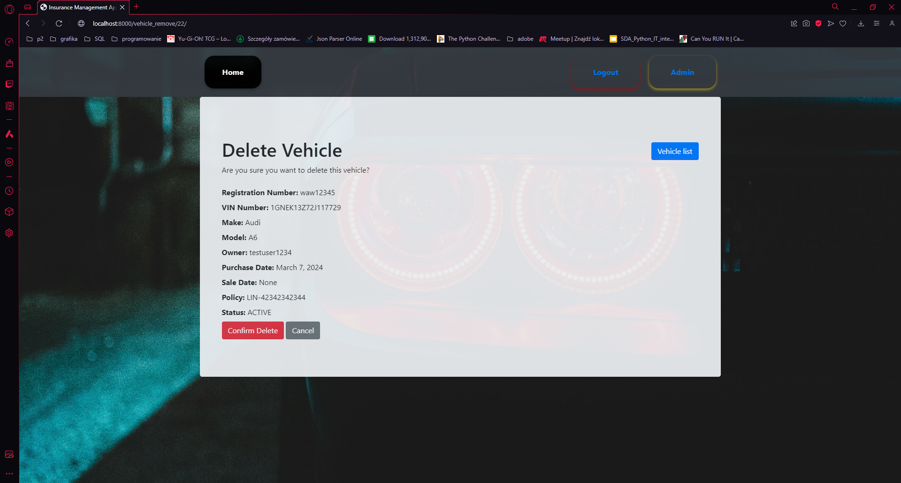

Bonus screenshots related to the administration panel:
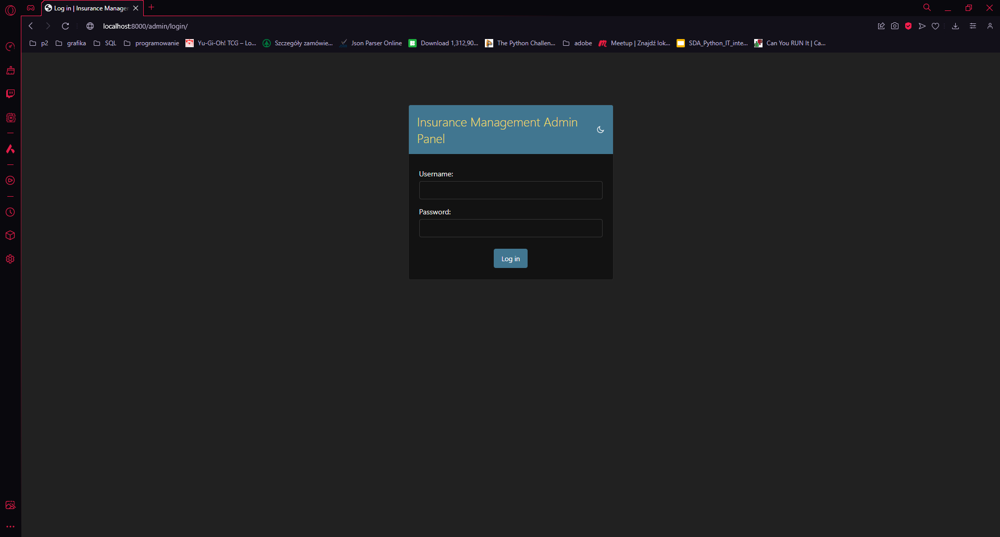
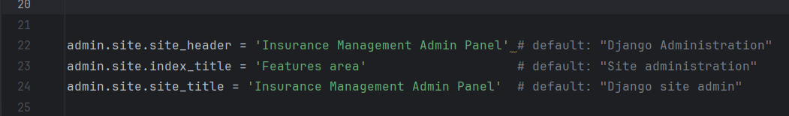
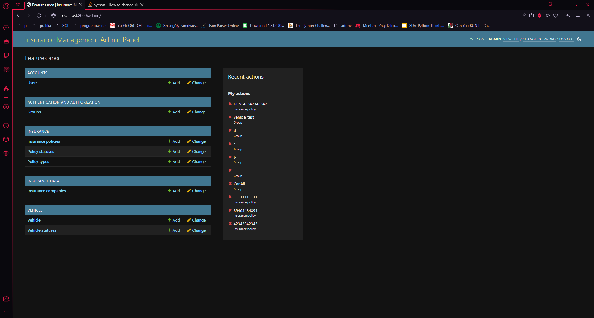
The above 3 screens are an additional thing that can be done to personalize the entire administration page for the application we are creating,

## Contributions

Any additional contribution to the project, such as reporting bugs, proposing new features, etc. is very welcome. 
Please contact any of authors regarding your observations, suggestions and comments.


## Authors

- Grzegorz Koniuszewski - Front-end, Back-end, Databases, Tests
https://github.com/grzegorzkoniuszewski
- Maciej Kulczycki - Front-end, Back-end, Databases, Tests
https://github.com/mackul1988
- Jakub Bułaj - Back-end
https://github.com/birbant

Special thanks for Mrs Beata Zalewa for suggestions, help and patience during making this project. 
